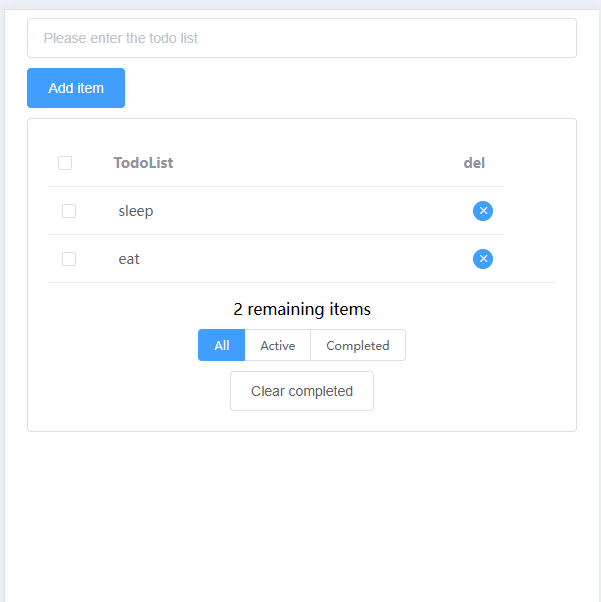

# 📝 Todo List Application

一个todolist应用，基于 Vue.js + Vuex + Element UI 构建。

## 🖼️ 实现效果图



### 🎯 核心功能
- ✅ **添加任务** - 通过输入框添加新任务
- ✅ **显示任务** - 清晰的任务列表展示
- ✅ **状态切换** - 支持任务完成/未完成状态切换
- ✅ **删除任务** - 一键删除不需要的任务
- ✅ **任务过滤** - 三种视图模式：全部、进行中、已完成
- ✅ **数据持久化** - 使用 localStorage 保存数据，刷新不丢失

### 🎨 用户界面
- 🎨 简洁极简的 Material Design 风格
- 📱 响应式设计，支持桌面和移动设备
- �� 直观的操作界面，易于使用
- 🚀 流畅的状态切换体验

## 🛠️ 技术栈

- **前端框架**: Vue.js 2.6.10
- **状态管理**: Vuex 3.1.2
- **UI组件库**: Element UI 2.13.2
- **构建工具**: Vue CLI 4.1.0
- **数据存储**: localStorage
- **开发语言**: JavaScript (ES6+)

## 🚀 快速开始

### 环境要求
- Node.js >= 12.0.0
- npm >= 6.0.0

### 安装依赖
```bash
cd todo-application
npm install
```

### 启动开发服务器
```bash
npm run dev
```

应用将在 `http://localhost:8080` 启动

### 构建生产版本
```bash
npm run build
```

### 代码检查
```bash
npm run lint
```

##  使用说明

### 添加任务
1. 在输入框中输入任务内容
2. 点击"Add item"按钮或按回车键添加任务

### 管理任务
- **完成状态**: 点击任务前的复选框切换完成状态
- **删除任务**: 点击任务右侧的删除按钮
- **批量操作**: 使用表头的复选框进行全选/取消全选

### 任务过滤
- **All**: 显示所有任务
- **Active**: 仅显示未完成的任务
- **Completed**: 仅显示已完成的任务

### 数据管理
- **清除已完成**: 点击"Clear completed"按钮批量删除已完成任务
- **自动保存**: 所有操作自动保存到浏览器本地存储

## 🏗️ 项目结构
